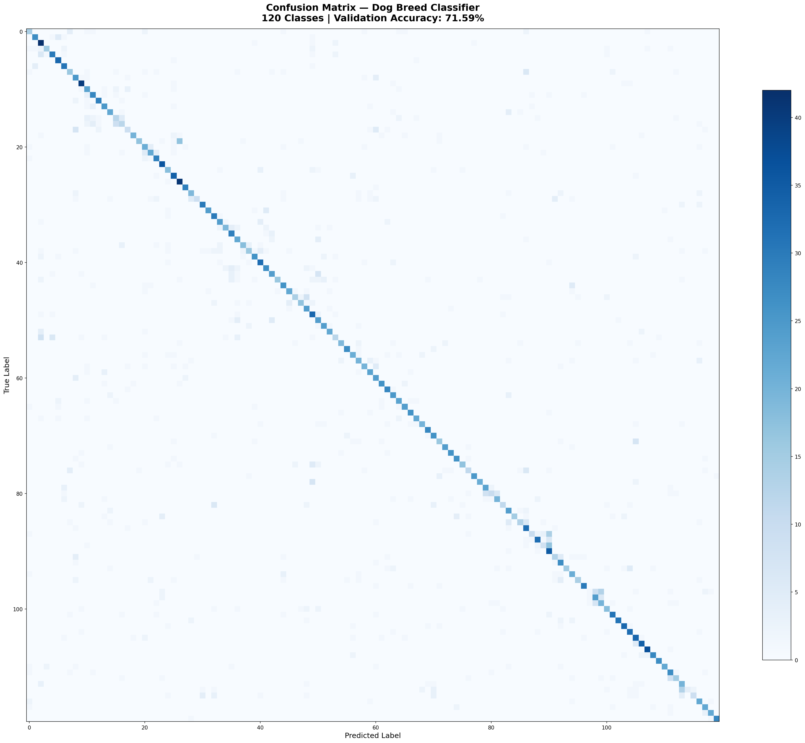
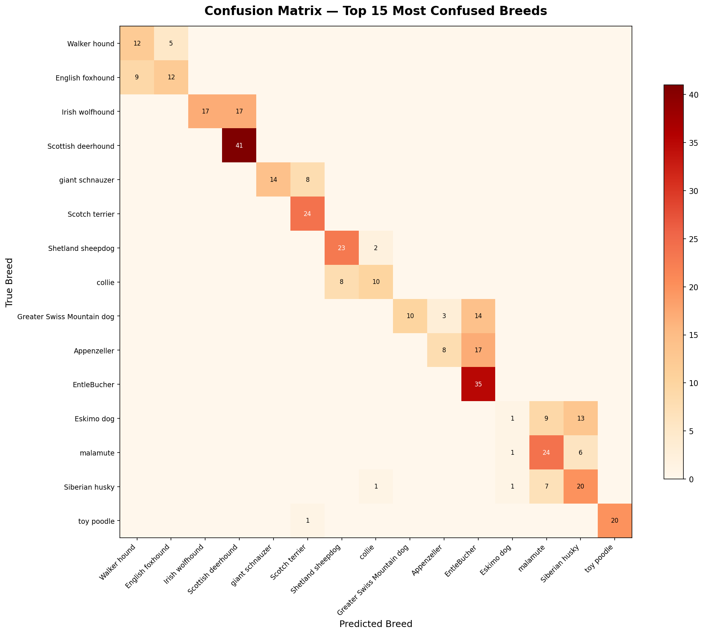

# Dog Breed Classification Using Deep Learning

## 1. Introduction & Dataset

Identifying dog breeds from images is a challenging fine-grained visual classification problem, as many breeds share remarkably similar physical characteristics — differing only in subtle features such as ear shape, coat texture, muzzle length, or body proportions. Traditional breed identification relies on expert knowledge, which is often slow, subjective, and inaccessible to the general public, animal shelters, or veterinary clinics.

This project presents a **Dog Breed Classification System** built using **Transfer Learning** with the **MobileNetV2** architecture. By leveraging a pre-trained convolutional neural network fine-tuned on breed-specific data, the system can classify dogs into **120 distinct breeds** while remaining lightweight enough for real-world deployment on resource-constrained devices.

### The Stanford Dogs Dataset

The model is trained on the **Stanford Dogs Dataset**, a widely used benchmark for fine-grained image recognition. The dataset contains:

- **20,580 images** spanning **120 dog breeds** from around the world
- Breeds range from common ones (Chihuahua, Golden Retriever, Labrador, German Shepherd) to rare breeds (Komondor, Kuvasz, Affenpinscher)
- Each breed directory includes bounding-box annotations in XML format
- The dataset is split into **Training (80% — 19,760 images)**, **Validation (10% — 3,833 images)**, and **Test (10% — 4,097 images)** subsets

---

## 2. System Demonstration

The developed Dog Breed Classification System provides a simple and user-friendly interface for testing dog images. During the demonstration, a user uploads a dog image through the **Streamlit** web application interface. The system automatically preprocesses the image by resizing it to 256 pixels, center-cropping to 224 × 224 pixels, and normalizing pixel values using ImageNet statistics before passing it to the trained deep learning model.

The model then analyzes the visual patterns of the dog — including fur texture, facial structure, body shape, and ear type — and predicts the breed class along with a confidence score. The output is displayed instantly on the screen, showing the **top 3 predicted breeds** with their confidence percentages and visual progress bars for easy interpretation.

The system supports JPG, JPEG, PNG, and WebP image formats. It automatically detects and utilizes GPU (CUDA) when available for faster inference, with seamless CPU fallback. The demonstration confirms that the system is efficient, responsive, and practical for everyday use in scenarios such as pet identification, shelter management, and breed-specific care recommendations.

---

## 3. Methodology

The core technology used in this project is **Transfer Learning**. Instead of training a model from scratch, we utilize a pre-trained neural network that already understands basic visual features like edges, textures, and patterns.

### Architecture: MobileNetV2

Designed for mobile efficiency, MobileNetV2 utilizes **Depthwise Separable Convolutions** and **Inverted Residual Blocks** to dramatically reduce parameter count while maintaining high feature extraction capability. Pre-trained on ImageNet (1.4 million images, 1,000 classes), it provides robust general-purpose visual features.

**MobileNetV2**
Efficiency Leader (~9.4 MB model size)

The original classifier head is replaced with a custom head for 120 breeds:
```
Dropout(p=0.4) → Linear(1280, 120)
```

### Training Strategy

1. **Data Augmentation:** To improve generalization, we applied random resized crops (224×224), random horizontal flips, and random rotations (±15°) to the training images. Validation images use a fixed resize + center crop pipeline.

2. **Phase 1 (Feature Extraction):** The pre-trained backbone weights were frozen, and only the custom classifier head was trained using **Adam optimizer** (lr=0.001). This allows the head to learn breed-specific mappings without disturbing the pre-trained features.

3. **Phase 2 (Fine-Tuning):** All layers of the backbone were unlocked and trained end-to-end with a much lower learning rate (**1e-5**) to gently adapt the feature extractor to dog-specific visual patterns without catastrophic forgetting.

4. **Loss Function:** Cross-Entropy Loss, standard for multi-class classification.

5. **Checkpointing:** The best model (by validation accuracy) is saved as `models/best_model.pth`.

---

## 4. Results & Discussion

The model was evaluated on the **validation split (3,833 images)** across all 120 breeds.

| Metric | MobileNetV2 |
|---|---|
| **Validation Accuracy** | **71.59%** |
| **Mean Per-Class Accuracy** | **70.81%** |
| **Best Class Accuracy** | Norwegian Elkhound (100.0%) |
| **Worst Class Accuracy** | Eskimo Dog (3.3%) |
| **Model Size** | ~9.4 MB |
| **Inference Latency** | Low (Fast) |

### Confusion Matrix

The full 120×120 confusion matrix below provides an overview of the model's classification performance across all breeds. The strong diagonal indicates correct predictions, while off-diagonal values show misclassifications.



### Most Confused Breeds

The following confusion matrix highlights the **top 15 most confused breeds** — those with the highest inter-class misclassification rates:



Common confusion pairs include visually similar breeds:
- **Scottish Deerhound ↔ Irish Wolfhound** — both are large, wiry-coated sighthounds
- **Siberian Husky ↔ Malamute ↔ Eskimo Dog** — similar sled-dog appearance with thick coats
- **Shetland Sheepdog ↔ Collie** — closely related herding breeds with similar facial structure
- **Walker Hound ↔ English Foxhound** — nearly identical tri-color hound body types
- **Appenzeller ↔ EntleBucher ↔ Greater Swiss Mountain Dog** — Swiss mountain dog family with similar markings

### Analysis

The 71.59% accuracy across 120 fine-grained classes demonstrates that MobileNetV2's efficient architecture can learn meaningful breed-specific features even with limited training epochs. The confusion patterns align with human intuition — breeds that are genuinely difficult for even experts to distinguish are the primary sources of error. The lightweight model size (~9.4 MB) makes it highly suitable for web-based and mobile deployment.

---

## 5. Conclusion

This project successfully demonstrates the power of **Transfer Learning** in the domain of fine-grained animal recognition. By utilizing MobileNetV2 with a two-phase training strategy, we achieved a functional classification system covering 120 dog breeds that is both accurate and computationally lightweight.

The resulting Streamlit web application provides an accessible interface for breed identification, bridging the gap between advanced deep learning research and practical utility for dog owners, shelters, and veterinary professionals.

Future iterations could:
- **Increase training epochs** for improved accuracy (current training used minimal epochs)
- **Ensemble with deeper architectures** (e.g., ResNet50, EfficientNet) for higher precision
- **Apply advanced augmentation** techniques like CutMix, MixUp, or AutoAugment
- **Add Grad-CAM visualizations** to explain which parts of the image drive each prediction
- **Integrate a mobile app** using model quantization for on-device inference
